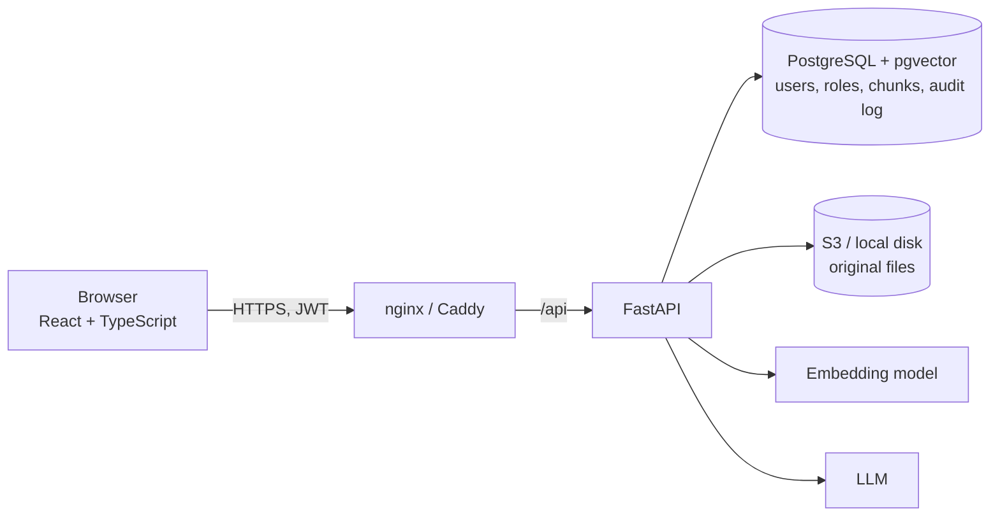

# Permission-Aware RAG Assistant

A document Q&A assistant where each user only gets answers drawn from documents their roles are allowed to see. The permission check runs **inside the database query**, so restricted text never reaches the LLM, and every answer cites the documents it came from.

Most RAG demos give the chatbot every document. In a real company that lets anyone ask about salaries or confidential plans. This project treats retrieval as an access-control problem.

| Document | Visible to |
| --- | --- |
| Employee handbook | all-staff, engineering, hr |
| Expense policy | all-staff |
| On-call runbook | engineering |
| Salary bands 2026 | hr |
| Performance review guide | hr |

An engineer asking *"What are the salary bands for senior engineers?"* gets *"I couldn't find that in the documents you have access to."* An HR user asking the same question gets the E3 band, citing **Salary bands 2026**. Both get the leave policy from the handbook.

## Features

- **Accounts and roles:** registration, argon2 password hashing, 15-minute JWTs. New users have no roles until an admin assigns them.
- **Ingestion:** admins upload PDF, Markdown or text files and pick which roles can see each one. Files go to S3 (local disk in development); text is extracted, chunked with overlap, embedded and stored in pgvector.
- **Permission-filtered Q&A:** one SQL statement does the role check and the similarity search together.
- **Citations:** answers list the document title and chunk position behind each `[n]` marker.
- **Honest refusals:** if no permitted chunk clears the similarity threshold, the assistant says so and the LLM is never called.
- **Instant revocation:** roles are resolved from the database on every request, so removing a role takes effect on the next question.
- **Audit log:** every question records who asked, when, which documents were retrieved, and whether it was refused.
- **Admin page:** manage documents, document roles, user roles and roles; browse the audit log.

## Quick start

Requires Docker.

```bash
docker compose up --build
```

Open http://localhost:8080. On first start the API seeds demo roles, users and the documents in [`sample_docs/`](sample_docs). All demo accounts use the password `demo-password` (local demo only):

| User | Roles |
| --- | --- |
| `admin@example.com` | admin; all-staff, engineering, hr |
| `alice@example.com` | all-staff, engineering |
| `hannah@example.com` | all-staff, hr |
| `newbie@example.com` | none |

API docs are at http://localhost:8000/docs.

By default the app runs fully offline. It uses a lexical **hash embedder** and an **extractive answerer**, which returns the best-matching cited sentences, so no API key or model download is needed. To use real models, copy `.env.example` to `.env` and set:

```bash
# OpenAI
EMBEDDING_PROVIDER=openai
LLM_PROVIDER=openai
OPENAI_API_KEY=sk-...

# or Ollama running on the host (ollama pull nomic-embed-text && ollama pull llama3.2)
EMBEDDING_PROVIDER=ollama
LLM_PROVIDER=ollama
```

Embeddings from different models aren't comparable. After changing `EMBEDDING_PROVIDER` or `EMBEDDING_DIM`, reset the data with `docker compose down -v` so documents are re-ingested. Then re-run the [eval](#answer-quality-eval) to pick a threshold for that model.

## Architecture



The browser only talks to the backend. When a user asks a question:

1. The React app sends the question with the user's JWT to `POST /ask`.
2. FastAPI verifies the token's signature and expiry, then loads the user's roles **from the database**. Roles in the request body are ignored.
3. The question is embedded.
4. One SQL query finds the most similar chunks among documents the user's roles allow.
5. If the best permitted match is below the similarity threshold, the API refuses without calling the LLM.
6. Otherwise the chunks go into a prompt that tells the LLM to answer only from them, cite them, and treat them as untrusted data.
7. The question and retrieved document ids are written to the audit log, and the answer is returned with its sources.

### Permission-filtered retrieval

Permissions live in two join tables: `user_roles` and `document_roles`. A user can see a chunk if they share at least one role with its document. ([`backend/app/retrieval.py`](backend/app/retrieval.py))

```sql
SELECT c.document_id, d.title, c.chunk_index, c.content,
       c.embedding <=> :embedding AS distance
FROM chunks c
JOIN documents d ON d.id = c.document_id
WHERE EXISTS (
    SELECT 1
    FROM document_roles dr
    JOIN user_roles ur ON ur.role_id = dr.role_id
    WHERE dr.document_id = c.document_id
      AND ur.user_id = :user_id
)
ORDER BY distance
LIMIT :k
```

Being an admin doesn't bypass this. Admins manage documents, but their answers still come only from their own roles.

### Data model

| Table | Key columns |
| --- | --- |
| `users` | id, email, password_hash, is_admin |
| `roles` | id, name |
| `user_roles` | user_id, role_id |
| `documents` | id, title, filename, s3_key, uploaded_by, created_at |
| `document_roles` | document_id, role_id |
| `chunks` | id, document_id, chunk_index, content, embedding `vector(768)` (HNSW, cosine) |
| `query_log` | id, user_id, question, retrieved_document_ids, refused, created_at |

## API

| Method | Endpoint | Who | Purpose |
| --- | --- | --- | --- |
| POST | `/auth/register` | Anyone | Create an account with no roles |
| POST | `/auth/login` | Anyone | Return a JWT |
| GET | `/me` | Logged in | Current user and roles |
| POST | `/ask` | Logged in | `{question}` → `{answer, refused, sources[]}` |
| GET | `/documents` | Logged in | Documents the user can see (admins: all) |
| GET | `/documents/{id}` | Logged in | One document; `404` if not visible |
| POST | `/documents` | Admin | Upload a file (multipart: `file`, `title`, `role_ids`) |
| PATCH | `/documents/{id}/roles` | Admin | Change who can see a document |
| DELETE | `/documents/{id}` | Admin | Remove a document, its chunks and its file |
| GET | `/users` | Admin | List users with roles |
| PUT | `/users/{id}/roles` | Admin | Set a user's roles |
| GET / POST | `/roles` | Admin | List or create roles |
| GET | `/admin/logs` | Admin | Audit log (`limit`, `offset`, `user_id`) |

## Security

- Passwords hashed with argon2. Login verifies a dummy hash for unknown emails so timing doesn't reveal which accounts exist.
- Short-lived HS256 JWTs. Signature, expiry and required claims are checked on every request, and a token for a deleted user is rejected.
- Roles are always resolved server-side from the database, never from the token or request body.
- `401` for missing, expired or tampered tokens; `403` on admin endpoints for non-admins; `404` (not `403`) for documents the user can't see, so their existence isn't revealed.
- Uploads are capped at 10 MB and limited to `.pdf`, `.md`, `.markdown` and `.txt`. Storage keys are generated server-side and local paths are checked against traversal.
- Document text is treated as untrusted. It's wrapped in `<source>` delimiters (closing tags stripped), and the system prompt says to ignore instructions inside it. The real protection is the SQL filter: an injected instruction can only see documents the asker already has access to.
- Secrets come from environment variables. In production, [`deploy/fetch-secrets.sh`](deploy/fetch-secrets.sh) writes them from SSM Parameter Store. `.env` is git-ignored.
- In production, Caddy terminates HTTPS with automatic certificates and HSTS; nginx adds CSP and other security headers.

## Testing

Tests run with pytest against a **real PostgreSQL + pgvector** database, not mocks, so the SQL itself is tested.

```bash
docker compose up -d db
cd backend
python -m venv .venv && source .venv/bin/activate   # Windows: .venv\Scripts\activate
pip install -e ".[dev]"
pytest
```

The tests create and use a `rag_test` database. Set `TEST_DATABASE_URL` to point them elsewhere.

**Permission tests** ([`tests/test_permissions.py`](backend/tests/test_permissions.py)):

- An engineer asking about salary bands retrieves no chunk from the hr-only document, even with `k=100`.
- An HR user asking the same question gets the salary document.
- Removing the hr role from a user, or from the document, blocks access on the very next question.
- A user with no roles retrieves nothing, and the admin flag grants no document access.
- A user who can see only a small document still gets results while the HNSW index is in use, even when hundreds of forbidden chunks are closer. A companion test shows the same query loses those rows when iterative index scans are turned off.

**API tests** ([`tests/test_api.py`](backend/tests/test_api.py)): `403` from every admin endpoint for non-admins, and `401` for missing, malformed, expired, tampered and wrong-key tokens. They also cover `404` for invisible documents, ignored `roles` in the request body, revocation through the API, upload type and size limits, deletion of chunks and files, and the audit log.

**Unit tests:** chunk sizes, overlap and coverage, plus empty and short inputs ([`tests/test_chunking.py`](backend/tests/test_chunking.py)). The refusal path, including the case where the LLM itself refuses, and prompt escaping ([`tests/test_rag.py`](backend/tests/test_rag.py)).

CI ([`.github/workflows/ci.yml`](.github/workflows/ci.yml)) runs ruff lint and format checks, then pytest against a pgvector service container. It also runs the Prettier check and production build for the frontend, and builds both Docker images, on every push.

## Answer-quality eval

[`backend/eval/questions.json`](backend/eval/questions.json) has 15 questions with known source documents and 4 off-topic questions that should be refused:

```bash
cd backend
python -m app.cli eval -v            # as admin@example.com, who has every role
```

It reports hit@1 and hit@k, plus the lowest best-match score of an answerable question and the highest of an off-topic one. The refusal threshold has to sit between those two numbers.

Results with the offline hash embedder:

| Chunk size / overlap (words) | hit@1 | hit@5 | Lowest relevant | Highest off-topic |
| --- | --- | --- | --- | --- |
| 40 / 10 | 14/15 | 15/15 | 0.127 | 0.132 |
| **60 / 15** (default) | **15/15** | 15/15 | 0.128 | 0.139 |
| 100 / 20 | 15/15 | 15/15 | 0.096 | 0.124 |
| 200 / 40 | 14/15 | 15/15 | 0.091 | 0.060 |

Small chunks give the lexical embedder its best ranking, because a short question overlaps a larger share of a short chunk. With no clean gap at 60/15, the default threshold of 0.12 favours answering. One off-topic question ("Who won the football match last night?") clears it on a weak lexical match. The answer step then still refuses, because no source sentence supports an answer. A real embedding model separates these far more clearly, so re-run the eval after switching models and set `SIMILARITY_THRESHOLD`.

## Command line

The CLI works without the web app (`python -m app.cli --help`):

```bash
python -m app.cli seed-demo
python -m app.cli ingest path/to/policy.pdf --roles all-staff,hr --title "Travel policy"
python -m app.cli ask "How many days of annual leave do I get?" --user alice@example.com
python -m app.cli create-admin you@company.com --roles all-staff    # password from $ADMIN_PASSWORD or prompt
```

## Local development

```bash
docker compose up -d db
cp .env.example .env                       # set JWT_SECRET
cd backend && uvicorn app.main:app --reload --env-file ../.env
cd frontend && npm install && npm run dev  # http://localhost:5173, proxies /api to :8000
```

## Deployment (AWS EC2 + S3)

[`deploy/docker-compose.prod.yml`](deploy/docker-compose.prod.yml) layers on top of the base compose file. It switches storage to S3, requires real secrets, stops publishing the database, API and web ports, and puts [Caddy](deploy/Caddyfile) in front for automatic HTTPS.

1. Create an S3 bucket with public access blocked and default encryption on.
2. Launch an EC2 instance with an IAM role allowing `s3:GetObject`, `s3:PutObject` and `s3:DeleteObject` on that bucket, plus `ssm:GetParametersByPath` on `/rag/*`. No AWS keys are stored on the instance. Set the instance metadata hop limit to 2 so containers can reach the role credentials.
3. Open ports 80 and 443 in the security group and point a DNS record at the instance.
4. Store `JWT_SECRET`, `POSTGRES_PASSWORD`, `S3_BUCKET`, `AWS_REGION`, `DOMAIN` (and `OPENAI_API_KEY` if used) as SecureString parameters under `/rag/`.
5. On the instance:

   ```bash
   git clone <this repo> && cd <repo>
   ./deploy/fetch-secrets.sh /rag
   docker compose -f docker-compose.yml -f deploy/docker-compose.prod.yml up -d --build
   docker compose exec api python -m app.cli create-admin you@company.com
   ```

The production override skips the demo seed and starts the API directly.

## Design decisions

| Decision | Options compared | Choice and reasoning |
| --- | --- | --- |
| Where to apply permissions | In SQL, after retrieval, in the prompt | **In SQL.** Telling the LLM "don't reveal HR documents" fails to prompt injection, because text the model receives can leak. Filtering after a top-k fetch can leave zero results even when permitted relevant chunks exist further down. Filtering in the query means forbidden text is never read. |
| Chunk size and overlap | 40 to 200 words | **60 words, 15 overlap** for the offline embedder, measured above. The chunker slices the original text on word boundaries, so tables and line breaks survive. With a real embedding model, larger chunks (roughly 200 to 400 words) give the LLM more context; re-run the eval to confirm. |
| Embedding model | Hosted (OpenAI), local (Ollama), offline hash | **Pluggable, at 768 dimensions.** That matches `nomic-embed-text` on Ollama (free, local) and `text-embedding-3-small` with `dimensions=768` (hosted, low cost, better quality). The hash embedder keeps CI and the demo free and deterministic, but it's lexical: it misses synonyms. |
| Vector index | None, HNSW, IVFFlat | **HNSW with `hnsw.iterative_scan = strict_order`.** HNSW gives good recall without a training step, unlike IVFFlat, and handles inserts well. The catch is that the index scans before the role filter applies. With the default `ef_search = 40`, a user who can see few documents can get fewer than k rows, or none. pgvector 0.8's iterative scan keeps searching until enough rows pass the filter, and `strict_order` keeps results exactly ordered. Both behaviours are pinned by tests. |
| Vector store | pgvector vs a dedicated vector DB | **pgvector.** Users, roles, documents and embeddings live in one database, so the permission join and the similarity search run in one transactionally consistent query. A separate vector DB would need permissions copied into metadata and kept in sync, which is exactly where revocation bugs come from. |
| Sessions | JWT vs server-side sessions | **Short-lived JWTs (15 min), with roles checked per request.** The token only proves identity. Authorization is re-read from the database on every request, so role revocation is instant despite stateless tokens. Deleting a user invalidates their token immediately. Full logout-everywhere would need a token version column or server-side sessions; that's left as a next step. |

## Project layout

```
backend/
  app/
    main.py            FastAPI app and routers
    retrieval.py       permission-filtered vector search
    rag.py             threshold, prompt, refusal, audit log
    ingest.py          extract → chunk → embed → store
    chunking.py        overlapping word-window chunker
    providers.py       hash / OpenAI / Ollama embedders and LLMs
    security.py        argon2 hashing, JWT
    routers/           auth, ask, documents, users and roles, admin
    cli.py             seed, ingest, ask, eval
  tests/               pytest suite (real Postgres)
  eval/questions.json  answer-quality set
frontend/              React + TypeScript (Vite), served by nginx
sample_docs/           demo documents and role manifest
deploy/                production compose override, Caddyfile, SSM secrets script
```

## Next steps

- Hybrid search: combine PostgreSQL full-text search with vectors for exact terms like policy numbers.
- Stream answers to the frontend.
- Terraform for the AWS setup.
- Move ingestion to a background worker, so large uploads don't block the request.
